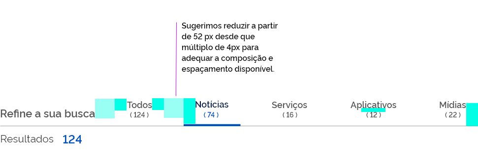

# Abas

As abas são utilizadas como elementos de navegação. O usuário pode migrar rapidamente entre elas e visualizar um conteúdo específico dentro de um mesmo contexto. Exemplo: dentro do assunto notícias, pode existir uma aba de política, outra de economia, outra de saúde.

#### Experiência Única

As informações são organizadas em assuntos. Cada aba se destina a um assunto dentro de um contexto específico, facilitando que o usuário encontre o que procura e possa facilmente migrar de um assunto para o outro.

#### Eficiência e Clareza

Abas são exibidas umas ao lado das outras, em categorias de igual importância, ou seja possuem o mesmo nível de hierarquia, mesmo se tratando de informações distintas dentro de um mesmo contexto.

#### Acessibilidade

As interfaces devem cumprir as diferentes necessidades de acessibilidade, por causa disso o tamanho da tipografia e as cores foram aplicadas prevendo-se um nível mínimo de adequação à legibilidade.

## Estrutura

Cada aba deve ter um label (rótulo) que a defina de forma clara e sintética. Para que a leitura não seja prejudicada nos aplicativos mobile, é recomendado que o label das abas sejam compostos de uma palavra apenas ou no máximo duas com a finalidade de manter a interface organizada. Sugerimos que só deve aparecer, no máximo, 06 abas por tela.

#### 1 | Abas Padrão

#### 2 | Abas com Contadores

Os contadores devem aparecer abaixo dos rótulos e alinhados ao centro com os mesmos.

#### 3 | Abas Deslocáveis

Utilizar essa opção quando a quantidade de abas exceder a largura da tela ou dispositivo. Nesse caso ao passar o mouse em cima da aba da direita todas as outras se deslocarão para esquerda, dando espaço às abas que estavam inicialmente escondidas. Nesse caso, o rótulo da última aba, pode aparecer truncado (com reticências), sinalizando ao usuário que há uma continuação. São bastante úteis para interfaces mobiles.

## Estados

Os estados das abas servem para dar feedback ao usuário sobre as ações que estão acontecendo quando há uma interação com o elemento.

#### A| Normal

O estado padrão do botão, como as abas são exibidas naturalmente na interface.

#### B | Selecionado

Acontece quando se clica numa aba.

#### C | Desabilitado

Abas inativas são indicados num tom de cinza mais claro indicando que sua ação está inativa.

#### D | Hover

O estado quando o cursor do mouse está sobre uma das abas.

## Anatomia

### Tom de Voz das Abas

O tom de voz das abas é, essencialmente, como elas vão se comunicar, qual assunto se trata, deixando claro para o usuário que assunto ele vai encontrar em cada aba.

Recomenda-se, sempre que possível, a utilização de substantivos que determinem de forma clara qual conteúdo se destina aquela aba. Evitar uso de siglas ou expressões que não são muito reconhecidas ao público em geral. Como mencionando anteriormente optar pelo uso de uma ou duas palavras apenas. Evitar rótulos muito grandes ou que confundam o usuário.

#### Formatação do Texto

Os textos dos botões precisam ser formatados em letras minúsculas com a primeira letra maiúscula. Ex.: Notícias

### Alinhamento

E o alinhamento entre o rótulo da aba e os contadores deve ser centralizado.

### Espaçamento

Observe as métricas definidas para os espaçamentos das abas.

### Poucos itens de abas - espaçamento

### Tipografia e Cor

