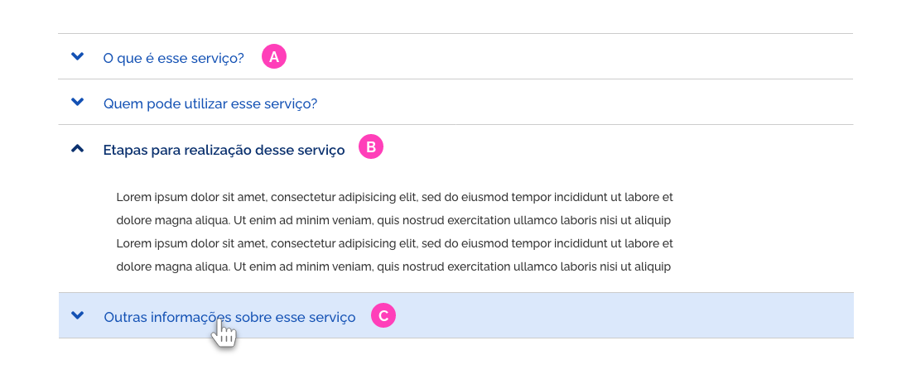

## Tipos de Accordeon

1 | Accordeon Positivo
O accordeon positivo pode ser aplicado em sistemas e também no Portal Único. Ele se apresenta sobre background claro e se apresenta da seguinte forma:

1 | Accordeon Negativo
Ele se apresenta sobre background escuro e se apresenta da seguinte forma:

## Estados do Accordeon

Os estados dos accordeon servem para dar feedback ao usuário sobre a intereção do usuário ao expandir, recolher, ou passar o mouse por cima de um item da lista.

### A | Interativo

O estado inicial do Accordeon, como ele é exibido na interface. Acompanhado do ícone de expandir (angle-down) que indica ao usuário que há itens a serem clicados.

### B | Ativo

Acontece quando se clica num item da lista e o mesmo se expande exibindo o conteúdo. Nessa situação o texto fica semibold e assume cor Primary Darken 01. E o ícone "angle-down” é substituído pelo de “angle-up“ indicando ao usuário, que o clique nos elementos do item expandido tem a ação de esconder o conteúdo.

### C | Hover

O estado quando o cursor do mouse está sobre o item a ser expandido ou recolhido. Nesse caso, o item recebe tratamento gráfico de hover, (um background azul claro aparece embaixo do item) sinalizando ao usuário a interação.

#### Positivo

#### Negativo

Sobre background negativo o hover deve seguir o padrão gráfico sobre fundo escuro.

## Anatomia

### Tom de Voz do Accordeon

O tom de voz do accordeon é, essencialmente, como ele vai comunicar qual assunto se trata, deixando claro para o usuário que assunto ele vai encontrar em cada detalhamento dos itens.

Recomenda-se, sempre que possível, a utilização de uma sentença, clara e sucinta, um resumo que determine de forma objetiva qual conteúdo será exibido. Evitar uso de siglas ou expressões que não são reconhecidas ao público em geral.**Não exceder uma linha de texto.** O detalhe de cada item deve aparecer quando o item for expandido.

### Formatação do Texto

Os textos dos itens foram formatados em letras minúsculas com a primeira letra maiúscula no estilo medium. Ao ser clicado o item passa a se apresentar no estilo semibold para auxiliar informar ao usuário que aquele item está ativo.

### Alinhamento

Os itens aparecem separados por uma linha de contorno cinza e os ícones de retrair e expandir aparecem alinhados entre si à esquerda, antes do texto.

##### 1 | Accordeon Positivo

##### 2 | Accordeon Negativo

### Espaçamentos

Seguem as métricas definidas para os espaçamentos dos acordeões. Todas as medidas foram definidas com valores múltiplos de 4px.

## Tipografia e Cor

#### 1 | Accordeon Positivo

A cor da fonte deve seguir a cor do estado ativo, pois é importante criar essa uniformidade com os outros componentes ativos da interface.

`

#### 2 | Accordeon Negativo

Por questões de acessibilidae, no accordeon negativo a cor da fonte passa a ser Secondary 01 (branca), mas os estilos seguem o mesmo padrão adotado no positivo.

