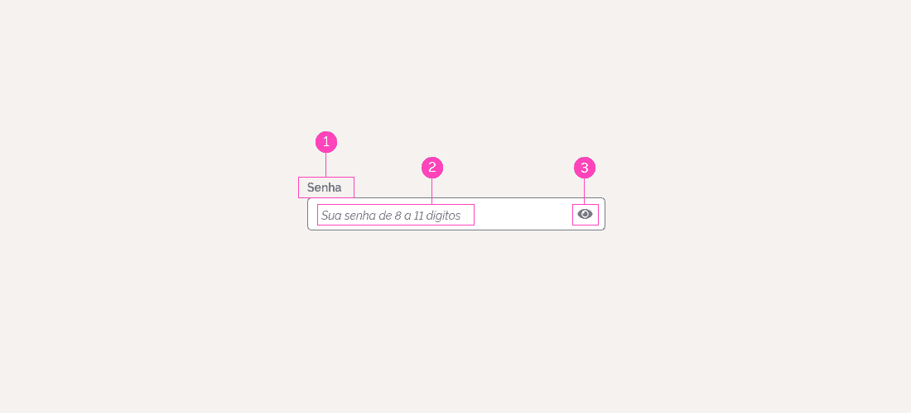
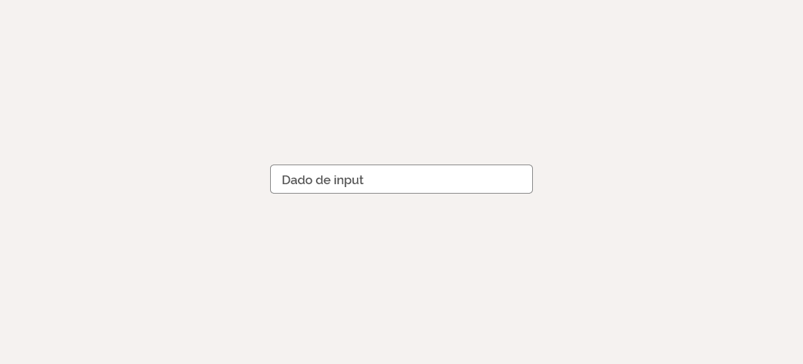
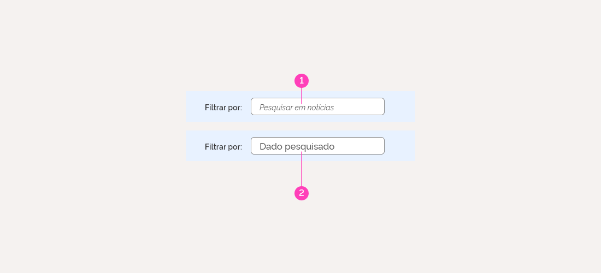
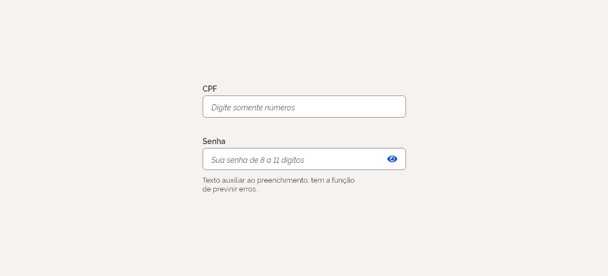
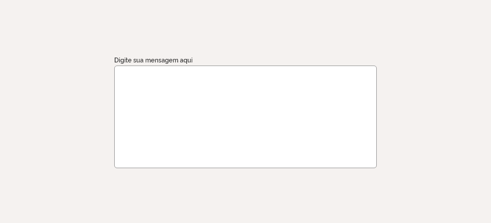
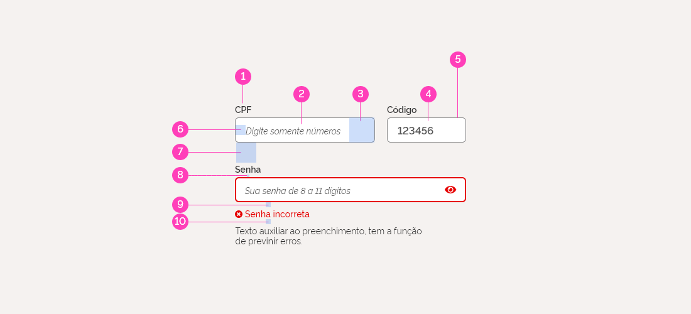
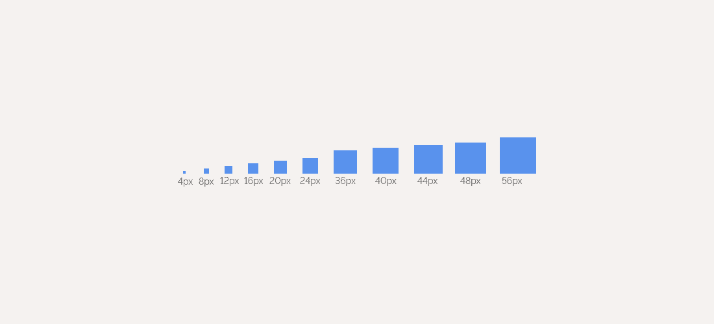
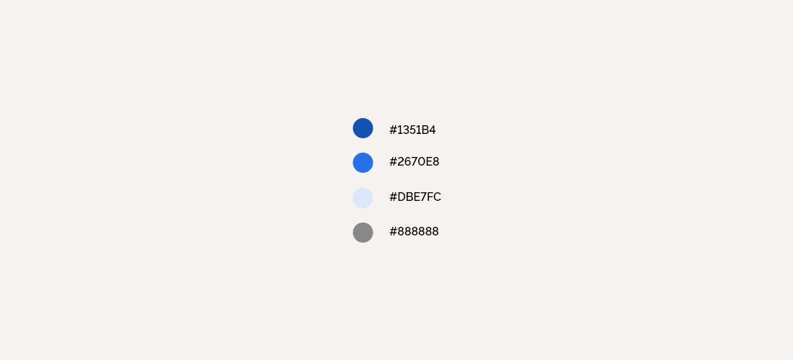

### Orientação de Uso

#### 1 | Rótulos

Devem ser acompanhados de rótulos que descrevam a informação que o usuário deve digitar.

#### 2 | Placeholder

O placeholder tem a função de auxiliar o usuário em como preencher os dados solicitados. Ele desaparece ao se começar a digitar no campo. E retorna no caso de exclusão da informação.

#### 3 | Ícones

Alguns também podem ter um ícone no canto direito. Por exemplo: o input de senha com o ícone de mostrar/ocultar a senha.

---

### Distintas Alturas dos Campos

As alturas dos campos de input devem variar em função de seus usos:

##### Grande

##### Pequeno

São utilizados em componentes de filtros

##### 1 | Placeholder

14px | Italic | #555555

##### 2 | Texto

16, 8px | Medium | #555555

---

### Rótulo e Informações Adicionais

Sempre que possível o rótulo do campo de texto deve ser o mais sucinto e claro possível. Entretanto, quando necessário, ele também pode exibir um texto com informações adicionais para auxiliar o preenchimento.

#### Inputs com texto auxiliar ao preenchimento

---

### Mensagens de Feedback Contextual

A mensagem de erro (feedback contextual) deve ser o mais sucinta possível, de preferência não ultrapassando uma linha da mesma largura do campo de texto.

---

### Mensagens de Crítica

A validação dos campos de texto deve exibir a mensagem de suporte abaixo do campo, juntamente com o ícone correspondente.

---

### Tipos de Input

#### Inputs - Estado normal / habilitado

#### Inputs - Estado focado

#### Inputs com texto auxiliar ao preenchimento

#### Validação do Input com texto auxiliar ao preenchimento

### Inputs Validação

### Inputs Aviso Caps Lock ligado

### Inputs desativado

### Inputs Textarea

Este componente representa um campo de entrada de dados com múltiplas linhas.Útil quando você quer permitir ao usuário informar um texto extenso, em formato livre, como um comentário em formulário de dados. Abaixo segue um exemplo do componente:

Este elemento possui as mesmas características estéticas com relação a espaçamentos, estados e anatomia dos campos Input Text.

---

### Anatomia

#### Campos de Texto

São elementos usados pelos usuários para digitar textos. Devem ser acompanhados de rótulos que descrevam a informação que o usuário deve digitar.

##### 1 | Rótulo

14px | Semibold | #555555

##### 2 | Placeholder

14px | Italic | #555555

##### 3 | Espaço mínimo interno entre o Placeholder e o limite do Input

40px

##### 4 | Texto do Input

16, 8px | Semibold | #555555

##### 5 | Borda do campo de texto

1px solid #888888

##### 6 | Espaço mínimo interno entre o texto/placeholder e o limite do input

16px na lateral esquerda

##### 7 | Espaço mínimo entre o campo de texto e o bloco abaixo

32px

##### 8 | Espaço mínimo entre o rótulo e o campo de texto

4px

##### 9 | Espaço mínimo entre o campo de texto e a mensagem contextual

8px

##### 10 | Espaço mínimo entre a mensagem contextual e o texto de auxílio ao preenchimento

8px

---

### Estados

Os campos de texto podem estar nos estados: **habilitado**, **ativo**, **com foco** e **desabilitado**.

#### Estado habilitado

#### Estado focado

#### Inputs desativados

---

### Espaçamentos

Segue as métricas definidas para os espaçamentos de todos os elementos utilizados no componente imput. Todas as medidas foram definidas com valores múltiplos de **4px** e **8px**.

---

### Cores

---

### Link Adobe XD para Especificações

https://xd.adobe.com/spec/7927f1ea-e05b-4e8a-5bf2-9c4931aae8d5-0f16/

