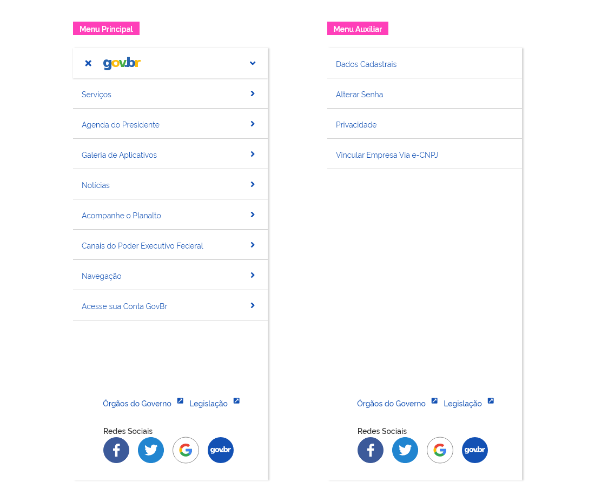
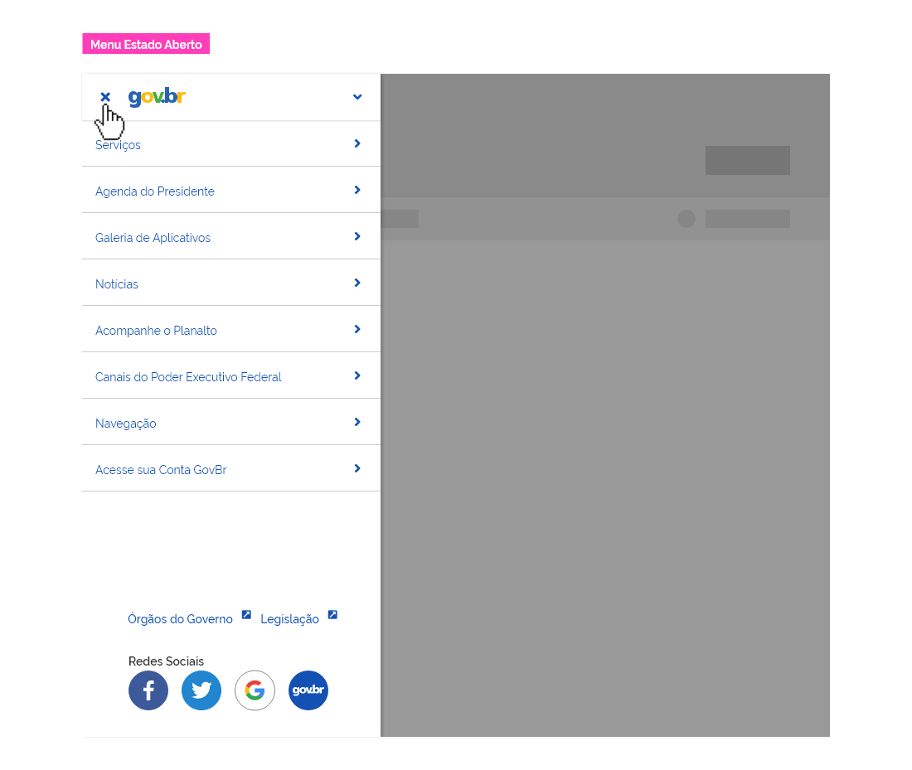
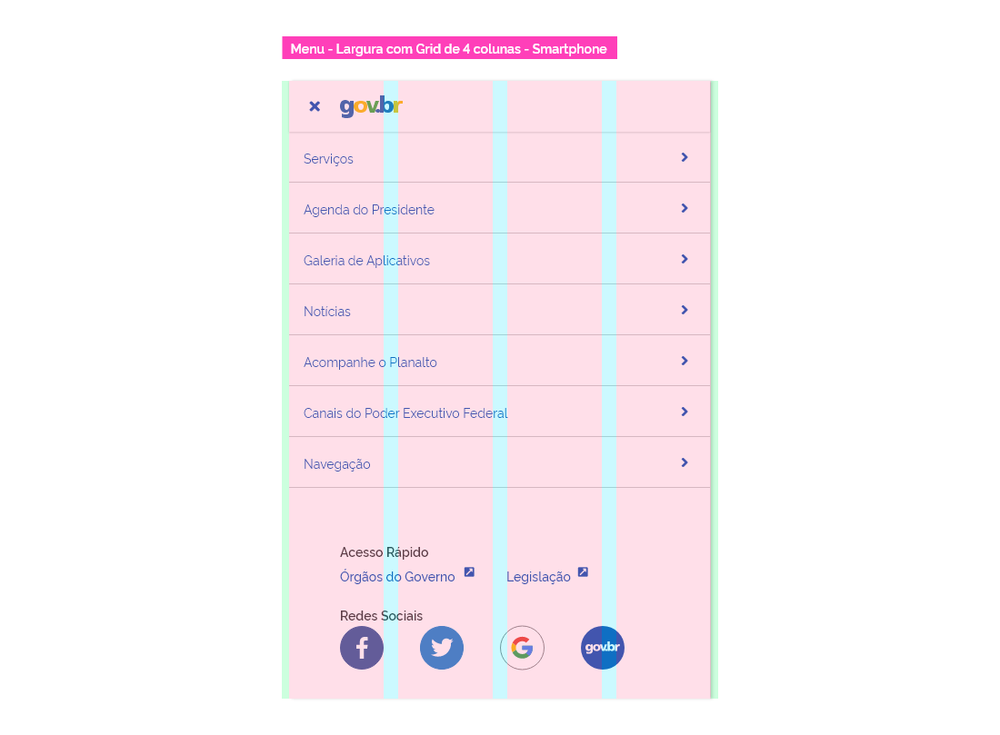
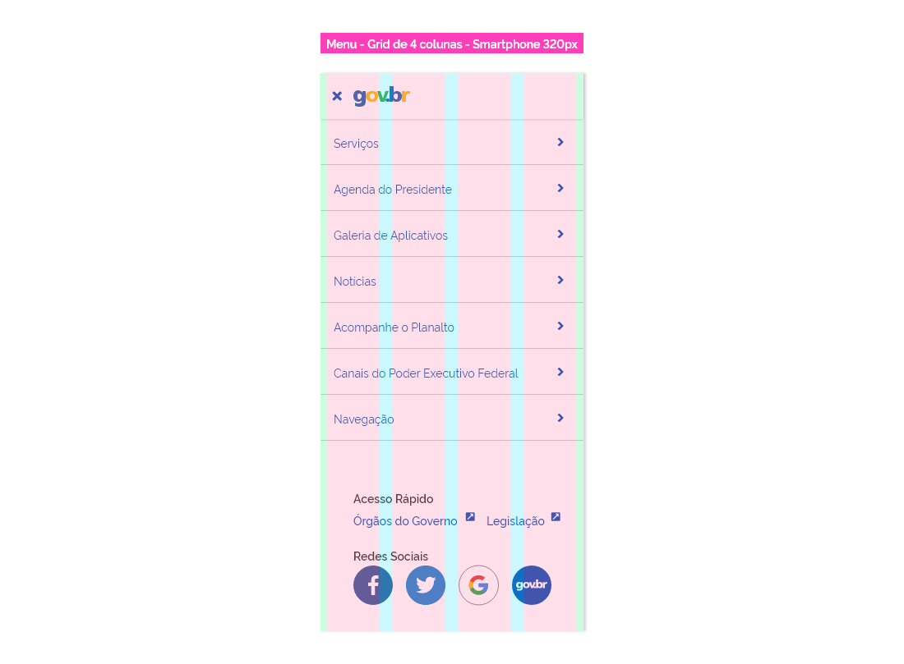
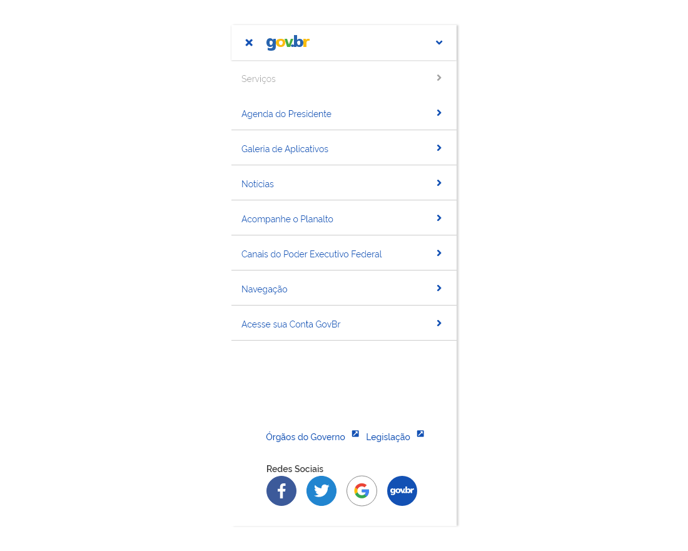

[version]: # (1.0.2)

# Menu
O menu deve ser utilizado para auxiliar o usuário na navegação através de todas as páginas do site ou sistema. Compreende um lista de itens ou opções, onde cada um desses itens chama outro programa ou página. Geralmente abrange todas as seções de um site ou seções dentro de um contexto específico.

---

## Uso

O menu deve ser utilizado com o objetivo de oferecer ao usuário acesso a todas as áreas ou páginas do site/sistema. Esse acesso será feito a partir dos links, categorizados em seções e subseções, quando houver. É imprescindível que haja um agrupamento claro nas seções e subseções do menu de forma coerente com a arquitetura da informação do site/sistema. 

### Tom de voz

Seguindo as boas práticas de design e usabilidade, o tom de voz utilizado no menu deve ser sucinto e objetivo. Por conta do espaço limitado, deve-se evitar o uso de textos longos e quebra do texto em duas ou mais linhas. Aqui deve-se usar o bom senso, a substituição de palavras grandes por sinônimos menores, com o objetivo de atender à comunicação clara ao usuário e ao mesmo tempo manter a boa estética. 

---

## Tipos

### Menu Principal

Através deste menu o usuário terá acesso a todos os links para as páginas do site/sistema e ficará disponível em todo seu escopo.

### Menu Auxiliar

O menu auxiliar ou secundário, é utilizado de forma contextual, auxiliando a navegação em algum subfluxo ou seção do site/sistema. Pode ser utilizado em conjunto com o Menu Principal. 

---

## Anatomia

O menu é constituido por:

**1 - Ícone "Acessar Menu Principal"**
**2 - Scrim entre o menu e a tela ao fundo**
**3 - Cabeçalho do Menu com Logo (Opcional)**
**4 - Botão fechar Menu**
**5 - Logo do Sistema/Site (Opcional)**
**6 - Cabeçalho Menu com Título**
**7 - Título para o Sistema/Site**
**8 - Ícone Expandir/colapsar**
**9 - Item do Menu**
**10 - Texto do Item do Menu**
**11 - Ícone de acesso aos subitens (Opcional)**
**12 - Separador**
**13 - Painel fixo ou flutuante**
**14 - Rodapé do Menu (Opcional)**
**15 - Área para links externos (Opcional)**
**16 - Área para botões de Mídias Sociais (Opcional)**

**1 - Ícone "Acessar Menu Principal"**
A partir deste ícone/botão o usuário poderá acionar o menu e ter acesso aos links para navegação.

**2 - Scrim entre o menu e a tela ao fundo**
Este elemento servirá para adicionar contraste entre o elemento menu e o conteúdo da tela ao fundo, direcionando a atenção do usuário ao conteúdo do menu. Neste contexto, será utilizado o **Componente Scrim** do tipo **Foco**, com **40% de opacidade** e **cor #000000**.

**3 - Cabeçalho do Menu com Logo (Opcional)**
Serve para identificar o Site/Sistema ou o bloco de agrupamento dos itens do Menu. O elemento **Cabeçalho com Logo** contém a logo do site/sistema, botão Expandir/Colapsar, caso tenha agrupamento de itens, e botão para fechamento do menu se este for o cabeçalho principal do menu. 

**A utilização do Cabeçalho com logo é opcional**, visto que nem todos sites ou sistemas possuem marca própria ou manual de identidade visual. Neste caso, deve-se optar pela utilização do Cabeçalho com Título. 

**4 - Botão fechar Menu**
Este elemento fica localizado no **Cabeçalho do Menu**, seja do tipo **Logo** ou **Título**, desde que este cabeçalho seja o principal do Menu. Caso haja dois ou mais cabeçalhos no Menu, o botão fechar só aparecerá no primeiro.

O botão fechar servirá para esconder o menu, fazendo-o voltar ao seu estado inicial. O usuário também poderá fechar o menu clicando fora dele ou deslizando o dedo lateralmente para esquerda (no caso de dispositivos móveis).

**5 - Logo do Sistema/Site (Opcional)**
Este elemento fica localizado no **Cabeçalho do Menu do tipo Logo**. Se o Sistema ou site possuir alguma identidade visual, é prioritário utilizar a logo com o Cabeçalho tipo Logo. **Caso o sistema ou site não tenham logo, deve-se optar pela utilização do Cabeçalho com Título.**

**6 - Cabeçalho Menu com Título**
Serve para identificar o Site/Sistema ou o bloco de agrupamento dos itens do Menu. Contém botão Expandir/Colapsar, caso tenha agrupamento de itens, e botão para fechamento do menu se este for o cabeçalho principal do menu. 

**7 - Título para o Sistema/Site**
Serve para identificar o nome do Site/Sistema ou o título do agrupamento dos itens. Deve ser utilizado no **Cabeçalho tipo Título**.

**8 - Ícone Expandir/colapsar (Opcional)**
Este elemento encontra-se localizado no cabeçalho do menu, seja do tipo **Logo** ou **Título**, desde de que hajam elementos filhos a serem agrupados. Serve para expandir/retrair o agrupamento dos itens filhos.

**9 - Item do Menu**
Este elemento compreende o **Componente de Lista**. Serve como item interativo para navegação no Menu ou Site. 

**10 - Texto do Item do Menu**
Este é o texto que descreve a página ou funcionalidade as quais o usuário irá navegar através dos links do menu.

**11 - Ícone de acesso aos subitens (Opcional)**
Encontra-se localizado no **Item do Menu** e aparece apenas quando há subitens relacionados a este item.

**12 - Separador**
Este é o **Componente Separador**, localizado na base do **Item do Menu** e serve para marcar a divisão entre estes.

**13 - Painel fixo ou flutuante do Menu**
Este painel é utilizado tanto no **Menu Principal** como no **Menu Auxiliar**. No Menu Principal, abrirá flutuando e deslizará lateralmente da esquerda para direita no lado esquerdo da tela e aparecerá juntamente com o elemento Scrim. Já no Menu Auxiliar este aparecerá fixo no canto esquerdo da tela.

**14 - Rodapé do Menu (Opcional)**
Fica posicionado na parte inferior do painel do menu e conterá algumas informações de apoio, como links para acesso a outros sites externos, acesso a mídias sociais, entre outras informações necessárias e contextuais ao site/sistema em questão. 

**OBS:** **Outras informações adicionais não previstas** - As áreas descritas abaixo **(15 e 16)**, são sugestões de informações adicionais que podem ser utilizadas no Rodapé do Menu, mas poderão ser **substituídas** ou **acrescentadas** por outras informações contextuais mais importantes, seguindo as necessidades de cada sistema/site. Neste caso, faz-se necessário respeitar os fundamentos visuais pré-definidos no Design System, como: padrão de Tipografia, Espaçamentos, Estados, Grid, Cores e Iconografia.

**15 - Área para links externos (Opcional)**
Localizado no rodapé do menu, conterá links úteis para sítios externos ao site/sistema em questão.

**16 - Área para botões de Mídias Sociais (Opcional)**
Área reservada para botões de acesso às mídias sociais vinculadas ao site/sistema.

---

### Comportamento

#### Acionamento

##### Menu Principal

O menu será acionado através do ícone "hamburguer" localizado sempre no cabeçalho do site/sistema à esquerda da logo. Após o acionamento através do evento 'clique' ou 'touch' **este aparecerá flutuando sobre o conteúdo da tela**. Sob o menu, aparecerá uma camada 'overlay' **(Componente Scrim do Tipo Foco)** na **cor preta** e com **40% de opacidade**, separando o menu do conteúdo da tela.

###### Menu Auxiliar

Este **permanecerá fixo no canto esquerdo da tela desde o carregamento da página**, não precisando ser acionado pelo usuário.

Quando for utilizado, o conteúdo da página será carregado à direita do menu e abaixo do Cabeçalho e Breadcrumbs, como mostrado no exemplo abaixo.

**1 - Cabeçalho**
**2 - Menu Auxiliar**
**3 - Breadcrumbs**
**4 - Conteúdo da Página**

#### Fechamento

##### Menu Principal

Para fechar o menu basta clicar no ícone 'Fechar' localizado no cabeçalho do menu à esquerda da logo.

#### Rolagem

##### Menu Principal

O menu poderá apresentar muitos itens, ultrapassando a altura do dispositivo em questão (Desktop, Tablet ou SmartPhone). Quando isto ocorrer, a altura do menu será igual a da tela do dispositivo em questão, com o cabeçalho ao topo da tela e rodapé na base da tela. Os itens do menu serão apresentados num área com rolagem entre o cabeçalho e rodapé do menu. Nos Smartphones, como a altura do dispositivo pode ser bem menor a rolagem ocorre de forma natural, rolando todo conteúdo do menu para cima ou para baixo conforme o controle do usuário.

#### Agrupamento de itens

##### Menu Principal

O componente menu poderá utilizar agrupamento de itens quando houver necessidade de organizar os links de navegação por tema. Quando isto ocorrer, será apresentado no canto direito do cabeçalho (tipo logo ou título) o ícone expandir/colapsar.

O item agrupador será do tipo **Cabeçalho com Título** ou **Cabeçalho com Logo** e os itens filhos, o item padrão do menu.

Ao clicar na seta **expandir/colapsar**, o bloco agrupador abrirá ou fechará deslizando para baixo ou para cima com o movimento do acordeão e o ícone expandir/colapsar alternará.

Quando houver mais de um item agrupador, deverá ser priorizado um deles para vir aberto por padrão, no caso o mais relevante ou o que se quer dar mais destaque inicialmente. Se um destes dois itens agrupadores forem expandidos o outro deverá ser fechado automaticamente. Não pode haver dois itens agrupadores abertos ao mesmo tempo.

#### Navegação em subníveis

##### Menu Principal

Quando houver subitens no menu, deverá ser apresentado uma seta indicadora no canto direito do item que possui os subitens. Ao clicar neste item, o menu será deslizado lateralmente para esquerda apresentando os itens filhos. Logo acima dos itens filhos, aparecerá o **item selecionado no estado ativo** com a seta de retorno para o nível anterior.

Poderá haver subníveis dentro de subníveis e o comportamento de navegação será sempre o mesmo para todos. Desta forma, o usuário terá sempre a sua frente a opção que ele escolheu e a possibilidade de retornar ao nível anterior. Caso o menu seja fechado e logo após aberto, será apresentado o nível de itens da raiz.

#### Tamanho x Colunas

##### Menu Principal e Auxiliar

Tendo em vista a variedade de resoluções e dispositivos existentes, não é possível determinar uma largura fixa para o componente menu. Sendo assim, a largura será ajustada à grid projetada para cada tipo de layout, atendendo aos diversos tamanhos de dispositivos. Abaixo seguem alguns exemplos.

##### Layout Desktop 1024px com 12 colunas

##### Layout Tablet 768px com 8 colunas

##### Layout Smartphone 480px com 4 colunas

Em dispositivos Smartphones o menu assumirá a largura completa da tela, ocupando todas as colunas da Grid.

##### Layout Smartphone 320px com 4 colunas (Largura mínima)

A largura de **320px** é a mínima suportada para smartphones. Nestas dimensões o menu ocupará toda tela e os espaçamentos internos serão reduzidos. Verifique os espaçamentos para esta largura em **Design Tokens** > **Espaçamentos**.

#### Estados

##### Estado Interativo

É o estado padrão do menu.

##### Estado Hover

O item do menu exibe uma nova cor quando o usuário passa o mouse sobre este.

##### Estado Foco

Ocorre quando a navegação é feita pela tecla TAB no teclado e o foco seleciona o item do menu.

##### Estado Disable

Ocorre quando o elemento está bloqueado ou inutilizável.

##### Estado Ativo

Ocorre quando o item do menu foi selecionado e o painel de subitens aparece.

**OBS:** Para mais detalhes a respeito das cores utilizadas nos estados, consultar a tabela de **Tokens** abaixo.

---

### Design Tokens

#### Cores

##### Painel

|Name|Property|Color Token|
|--|--|--|
|Painel Flutuante|background|`--color-secondary-01`|
|Painel Fixo|background|`--color-secondary-01`|

##### Cabeçalho do Menu - Tipo Logo e Título

|Name|Property|Color Token|
|--|--|--|
|Background do Cabeçalho|background|`--color-secondary-01`|
|Cor do Título|color|`--color-primary-default`|
|Cor do Ícone Fechar |color|`--color-primary-default`|
|Cor do Ícone Expandir/Retrair |color|`--color-primary-default`|

##### Item do Menu

|Name|Property|Color Token|
|--|--|--|
|Background do Item|background|`--color-secondary-01`|
|Cor do Texto|color|`--color-primary-default`|
|Cor do Ícone|color|`--color-primary-default`|

##### Rodapé do Menu

|Name|Property|Color Token|
|--|--|--|
|Background do Rodapé|background color|`--color-secondary-01`|
|Cor do Título|color|`--color-secondary-08`|
|Cor do Texto|color|`--color-primary-default`|
|Cor do ícone link|color|`--color-primary-default`|
|Cor do ícone Mídias Sociais|color|`--color-primary-default`|

#### Iconografia

##### Cabeçalho do Menu

|Name|ícone|Size|Class (Font Awesome)|
|--|--|--|--|
|Ícone Expandir|<i class="fas fa-angle-down"></i>|`--icon-size-base` |`fa-angle-down`|
|Ícone Retrair|<i class="fas fa-angle-up"></i>|`--icon-size-base` |`fa-angle-up`|

##### Item do Menu

|Name|ícone|Size|Class (Font Awesome)|
|--|--|--|--|
|Ícone Expandir|<i class="fas fa-angle-down"></i>|`--icon-size-base` |`fa-angle-down`|
|Ícone Retrair|<i class="fas fa-angle-up"></i>|`--icon-size-base` |`fa-angle-up`|
|Acionar Subnível|<i class="fas fa-angle-right"></i>|`--icon-size-base` |`fa-angle-right`|
|Retornar Subnível|<i class="fas fa-angle-left"></i>|`--icon-size-base` |`fa-angle-left`|

##### Rodapé do Menu

|Name|ícone|Size|Class (Font Awesome)|
|--|--|--|--|
|Ícone Link Externo|<i class="fas fa-external-link-square-alt"></i>|`--icon-size-sm` |`fa-external-link-square-alt`|

#### Tipografia

##### Cabeçalho do Menu

|Name|Size|Weight|
|--|--|--|
|Texto do Cabeçalho|`--font-size-scale-base`|`--font-weight-regular`|

##### Item do Menu

|Name|Size|Weight|
|--|--|--|
|Texto do Item|`--font-size-scale-base`|`--font-weight-regular`|

##### Rodapé do Menu

|Name|Size|Weight|
|--|--|--|
|Título do Rodapé|`--font-size-scale-base`|`--font-weight-semi-bold`|
|Texto do Rodapé|`--font-size-scale-base`|`--font-weight-medium`|

#### Estados

##### Item do Menu

|Name|Estado|Property|Status Token|Opacity|
|--|--|--|--|:--:|
|Background|Hover|background color|`--status-hover-background`| - |
|Background|Disable|background color|`--status-disabled-background`|45%|
|Background|Foco|background color|`--status-focused-overlay`|30%|
|Background|Active|background color|`--status-activated-background`|-|
|Texto/Ícone|Hover|color|`--color-secondary-08`|-|
|Texto/Ícone|Disable|color|`--status-disabled-text`|45%|
|Texto/Ícone|Foco|color|`--color-secondary-08`|-|
|Texto/Ícone|Active|color|`--status-activated-text`|-|

##### Rodapé do Menu

|Name|Estado|Property|Color Token|Opacity|
|--|--|--|--|:--:|
|Texto/Ícone|Hover|color|`--color-secondary-08`| - |
|Texto/Ícone|Disable|color|`--status-disabled-text`| 45% |
|Texto/Ícone|Foco|color|`--color-secondary-08`| - |
|Background Texto/Ícone|Hover|color|`--status-hover-background`| - |
|Background Texto/Ícone|Disable|color|`--status-disabled-background`| 45% |
|Background Texto/Ícone|Foco|color|`--status-focused-overlay`| 30% |

#### Dimensões

|Name|Property|Value|
|--|--|:--:|
|Cabeçalho do Menu |Height| `56px` |
|Cabeçalho do Menu |Width| `variável` |
|Item do Menu|Height| `56px` |
|Item do Menu|Width| `variável` |
|Rodapé do Menu|Height| `200px` |
|Rodapé do Menu|Width| `variável` |

#### Espaçamentos

##### Menu tamanho padrão

|Name|Property|Value|
|--|--|:--:|
|Cabeçalho do Menu|padding-left| `--spacing-scale-2x` |
|Cabeçalho do Menu|padding-right| `--spacing-scale-2x` |
|Item do Menu|padding-left| `--spacing-scale-2x` |
|Item do Menu|padding-right| `--spacing-scale-2x` |
|Rodapé|padding-left| `--spacing-scale-7x` |
|Rodapé|padding-right| `--spacing-scale-2x` |
|Rodapé|padding-top| `--spacing-scale-3xh` |
|Rodapé|padding-bottom| `--spacing-scale-4x` |

##### Menu Largura Mínima (320px)

|Name|Property|Value|
|--|--|:--:|
|Cabeçalho do Menu|padding-left| `--spacing-scale-base` |
|Cabeçalho do Menu|padding-right| `--spacing-scale-2x` |
|Item do Menu|padding-left| `--spacing-scale-5x` |
|Item do Menu|padding-right| `--spacing-scale-2x` |
|Rodapé|padding-left| `--spacing-scale-5x` |
|Rodapé|padding-right| `--spacing-scale-2x` |
|Rodapé|padding-top| `--spacing-scale-3xh` |
|Rodapé|padding-bottom| `--spacing-scale-4x` |