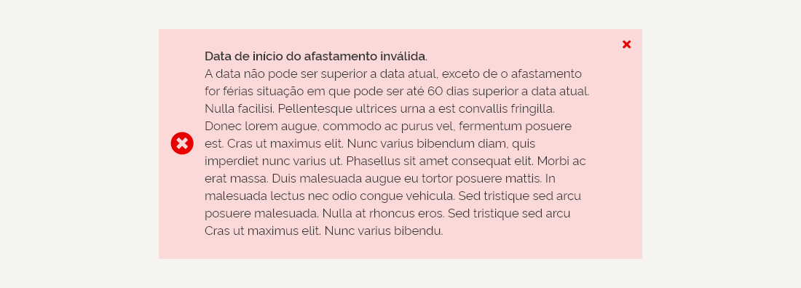
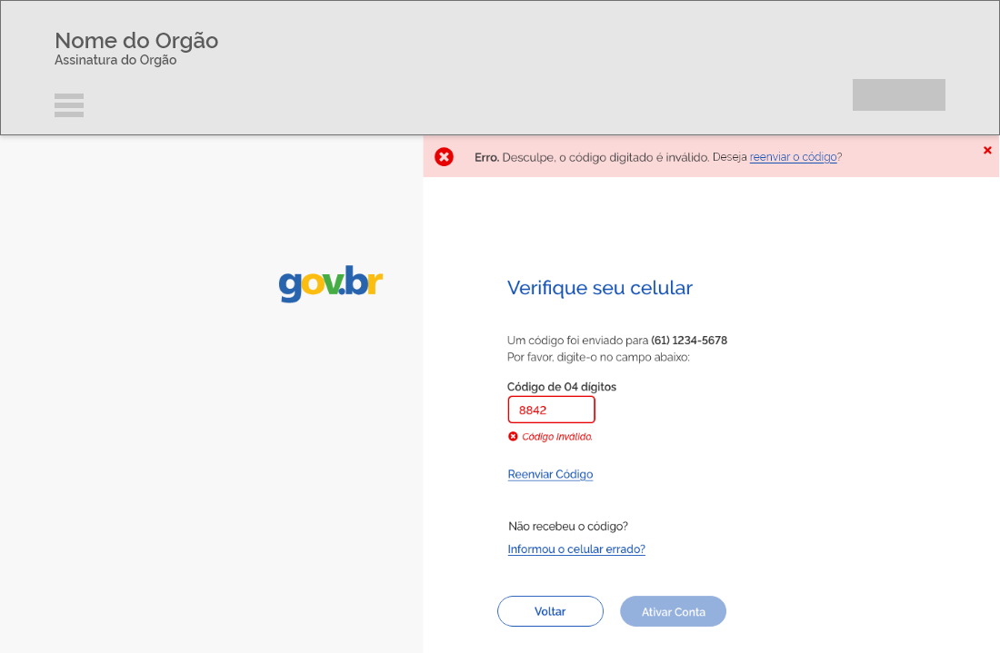
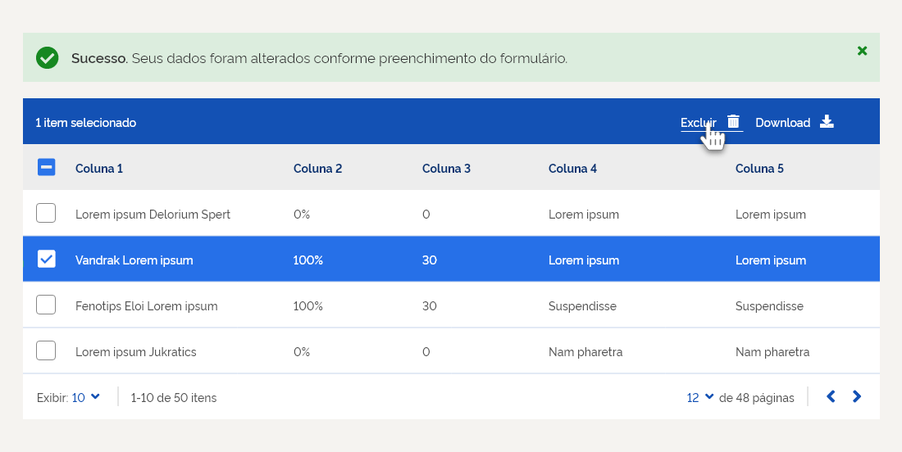
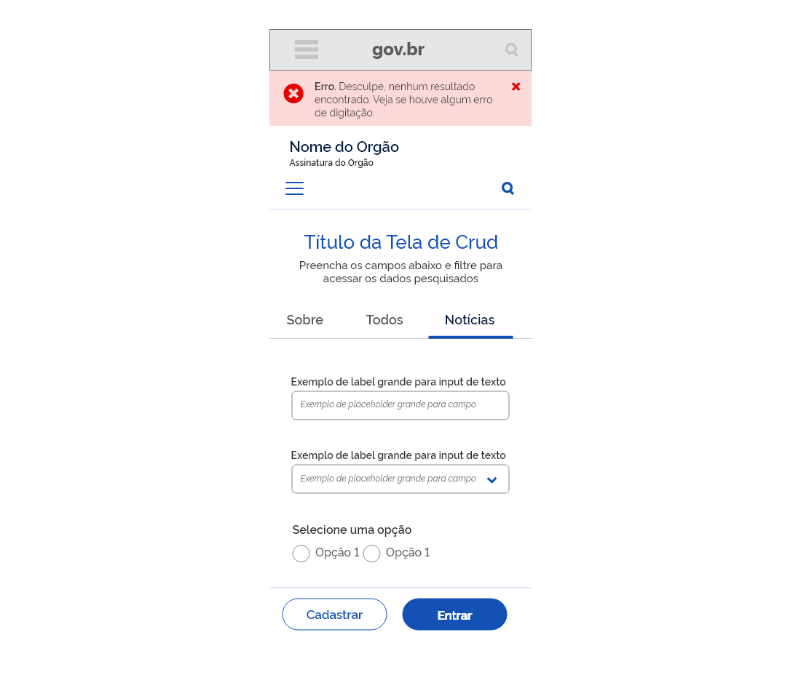
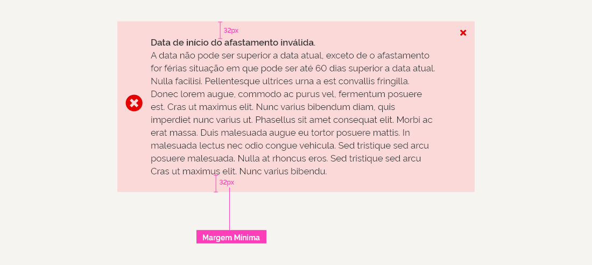
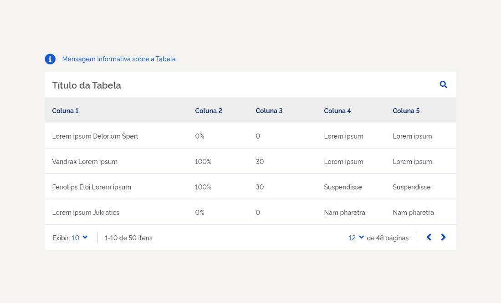
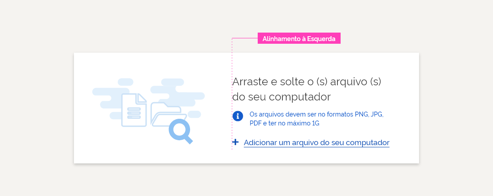

[version]: # '11.0.0'

## Tipos

A cor é um bom recurso para comunicar, porém pensando em acessibilidade é necessário utilizar mais um recurso para que essa mensagem seja entendida. Além da cor, o ícone é utilizado para comunicar ao usuário o tipo de alerta e sua importância. Nesse caso, o ícone pode auxiliar na transmissão de informações que deverão ser percebidas tanto pelos usuários que não tem problemas de visão, como pelos que têm alguma dificuldade ou não podem perceber a diferença entre as cores.

**1 | Mensagens de Erro**
As mensagens de Erro são utilizadas para informar ao usuário que algo não saiu como ele esperava. O ideal é que no final
dessa mensagem apareça alguma sugestão de como o usuário possa resolver aquela situação.

**2 | Mensagens de Sucesso**
As mensagens de Sucesso servem para auxiliar o usuário para que este perceba o resultado de sua ação. Exemplo, ao salvar dados numa tabela ou formulário.

**3 | Mensagens de Atenção**
As mensagens de Atenção, muitas vezes trazem informações que possam alertar ao usuário que determinada ação depende de outra ação
prévia, ou que haverá alguma consequência após a realização de uma ação e que esta merece uma atenção maior do usuário.

**4 | Mensagens de Informação**
As mensagens Informativas, são muitas vezes dicas para que o usuário entenda melhor o que o sistema está solicitando. Serve mais ou menos
como tópicos de ajuda.

## Tom de Voz

A linguagem utilizada nas mensagens deve ser clara e objetiva. É fundamental que o usuário entenda o que aconteceu, as consequências e o que pode ser feito. Então, é interessante que na mensagem venham sugestões de como o usuário pode resolver a questão.

## Estrutura

As mensagens são compostas por um ícone indicativo, um texto, um ícone para fechar a mensagem e um container retangular que serve de suporte ao texto e o ícone.

No que diz respeito a estética, as mensagens devem ocupar toda largura da área útil na tela, definida pela grid. O texto porém pode ocupar uma linha, duas, ou mais de duas, como exemplificado abaixo.

**A | Ícone Indicativo do Tipo de Mensagem**
**B | Card (retângulo de suporte a mensagem)**
**C | Texto da mensagem**
**D | Ícone para fechar a mensagem**

**Texto ocupando 1 linha**
Nesse caso, o texto ocupará apenas 1 linha e aparecerá centralizado horizontalmente com o ícone e com o box da mensagem. O texto deve sempre aparecer alinhado à esquerda.

**Texto ocupando 2 ou mais linhas**
Nesse caso, o texto ocupará 2 ou mais linhas e aparecerá centralizado horizontalmente com o ícone e com o box da mensagem. A altura do container pode variar de acordo com o tamanho da mensagem. O texto deve sempre aparecer alinhado à esquerda.

Nas mensagens que ultrapassam 1 linha de texto, deve-se destacar com semibold a ideia principal da mensagem e a mesma deve aparecer na primeira linha do texto. O resto do texto deve aparecer a partir da segunda linha com fonte regular.

Quando houver necessidade de aparecer mais de uma mensagem, deve-se repetir o box para que o usuário perceba que se trata de mensagens diferentes.

**Em modal**
Deve se recorrer ao uso de modal, somente nos casos em que seja necessário impedir que o usuário prossiga sem ler ou que seja necessário ele realizar uma ação, que tenha um impacto maior, como é o caso da exclusão de dados. O ícone deve sempre aparecer centralizado horizontalmente com a altura do container e o texto deve sempre vir alinhado à esquerda.

## Posicionamento e comportamento

**Em sistemas**
No sistema, deve-se posicionar as mensagens logo abaixo do cabeçalho e antes do conteúdo da tela. O comportamento esperado é que a mensagem possa ser fechada acionando o ícone de fechar “x” ou depois de 1 minuto sem interação do usuário ela fechará automaticamente.

**Antes de tabelas**
No sistema, deve-se posicionar as mensagens logo abaixo do breadcrumb e antes do conteúdo da tela. O comportamento esperado é que a mensagem empurre o conteúdo para baixo. E possa ser fechada acionando o ícone ou depois de 1 minuto.

**Outros formatos**
No caso dos dispositivos móveis a largura do container da mensagem deve se adequar à largura de cada dispositivo. E deve vir sempre antes de todo o conteúdo.

## Dimensões

**Texto ocupando 1 linha**
Nesse caso, o box de fundo da mensagem deve ter 60px de altura e a largura deve ser a mesma largura do conteúdo da tela. O ícone deve vir centralizado dentro desse container. Uma margem mínima superior e inferior de 20px deve ser deixada entre o texto e a borda do container retangular. O texto não deve ultrapassar a área de toque do ícone de fechar ‘x’.

**Texto ocupando 2 ou mais linhas**
Nesse caso, o box deve aumentar de acordo com o texto, sempre respeitando a margem mínima de 20px. A largura do container deve ser a mesma largura do conteúdo da tela.

## Ícones de Alerta

Os ícones das mensagens de alerta horizontais deverão, ter 28px, mas serão exibidos com uma área total de 36x36px. Se houver necessidade de clique a área do toque deve ser 48px.

Já os que aparecem nas mensagens dentro de pop ups devem ter 32 x 32px e uma área total de 48x48px.

As mensagens que aparecem dentro de pop ups devem ter 32 x 32px de margem mínima, entre o texto e a borda.

---

## Mensagens Contextuais

As mensagens servem para dar feedback pontual ao usuário sobre o preenchimento dos campos dentro de um formulário. Elas devem ser claras e devem ajudar o usuário a corrigir os erros. Mensagens como: “Ocorreu um erro” não dão orientações de como deva ser o preenchimento. Sempre que possível evitar situações que conduzam ao erro e sempre oferecer dicas sobre o preenchimento dos campos.

Aparecem logo abaixo dos campos de input. Elas devem aparecer na tela. assim que o usuário preencher um campo do formulário e passar para o próximo. Dessa forma, fica claro para usuário se o preenchimento foi correto ou se ele necessita redigitar a informação. Isso deve sempre ocorrer antes do usuário percorrer todo o formulário, agilizando e melhorando a experiência no uso do sistema.

**Validação Positiva**
Aparecem logo após o preenchimento do campo e servem para indicar ao usuário que ele digitou os dados de forma correta, dando um Feedback positivo.

**Validação Negativa**
Aparecem logo após o preenchimento do campo e servem para indicar ao usuário que ele digitou os dados de forma diferente da esperada. É importante deixar claro o que saiu errado e/ou dar sugestões de como o usuário pode preencher o campo de forma satisfatória.

**Informativo**
As mensagens Informativas, são muitas vezes dicas para que o usuário entenda melhor o que o sistema está solicitando. Serve mais ou menos como tópicos de ajuda. Podem aparecer dentro de componentes, como por exemplo a informação que traz as características de como deve ser a imagem a ser anexada dentro do componente de Upload. Pode vir contida também dentro de outros componentes, como por exemplo nas tabelas, com intuito de oferecer algumas informações complementares.

## Tom de voz

A linguagem utilizada nas mensagens deve ser clara e concisa. É fundamental que o usuário não fique constrangido com o erro e que receba informações que o oriente na utilização do sistema. É recomendável utilizar expressões como "por favor" e "desculpe" a fim de criar uma maior empatia com o usuário.

## Estrutura

### Mensagens de Validação

No que diz respeito a estética, as mensagens devem ser breves e aparecer logo abaixo dos inputs, junto ao ícone que irá auxiliar o usuário a identificar se a validação foi positiva ou negativa.

**A | Ícone**
Devem vir alinhados à esquerda com o campo de texto.

**B | Texto da Mensagem**
Aparecem logo após o ícone.

### Mensagens de Texto Informativo

Podem aparecer acima ou inseridas nos componentes. Aparecem acompanhadas por um ícone que simboliza a ideia de informação. O ícone aparece primeiro em destaque e logo após aparece a mensagem que se quer comunicar. Essa mensagem deve vir sempre alinhada à esquerda com o componente ou com elementos do componente. O texto pode ocupar uma ou duas linhas. Não se deve exceder duas linhas. Centralizar horizontalmente o texto com o ícone da mensagem. O texto deve vir sempre alinhado à esquerda.

**A | Ícone**
Devem vir alinhados à esquerda com o componente ou com elementos do componente.

**B | Texto da Mensagem**
Aparecem logo após o ícone.

## Especificação

<https://xd.adobe.com/view/bb4626d4-c633-42c0-5718-a3d3735a4b27-cd77/>
