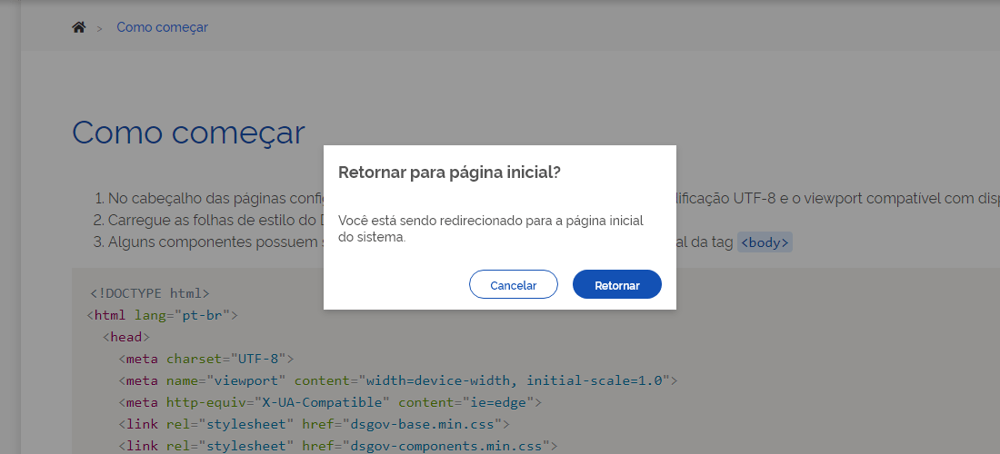

## Uso

Modal é um conteiner que aparece sobre um conteúdo de interface, para fornecer informações críticas ou solicitar uma decisão. São apresentados em conjunto com um [scrim](#). Requer concentração do usuário, permanecendo visível até que alguma ação seja tomada.

Modais são propositadamente interruptivos, portanto devem ser usados ​​com moderação.

Utilize para:

- Erros que impedem o fluxo normal de uma interface;
- Informações críticas que requer uma escolha, decisão ou reconhecimento específico do usuário;
- Entrada de dados sem a perda contextual de uma tela;

### Tom de voz

Modais devem manter uma comunicação direta nas informações e dedicados à conclusão de uma tarefa. Devem aparecer em resposta a uma tarefa ou ação do usuário, com informações relevantes e contextuais.

---

## Anatomia

1. **Card**
2. **Título** (_opcional_)
3. **Conteúdo**
4. **Botões**
5. **Ícone de cancelar** (_opcional_)
6. **Scrim**

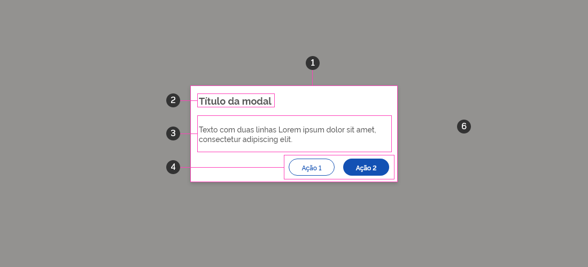

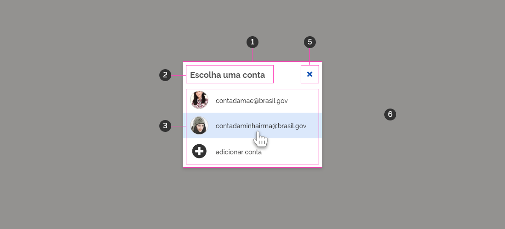

---

### Título

#### Tom de voz:

Deve ser uma declaração ou pergunta específica, breve e clara;
Evite termos que expressão ambiguidade, alarmam o usuário como: "_Desculpe pela interrupção_", "_Aviso!_", "_Você tem certeza?_".

#### Comportamento

Se necessário, os títulos podem quebrar para um segunda linha. Maiores que duas linhas, os textos devem ser contraídos com reticências (...), e ao passar o mouse sobre o texto contraído, deverá ser revelado o texto completo pelo uso de [tooltip](#).

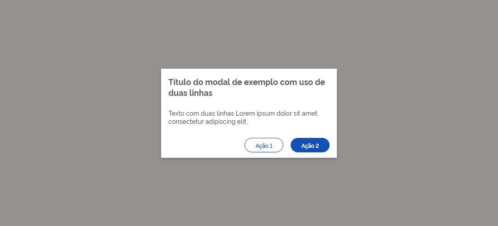

---

### Conteúdo

Conteúdo pode ter várias representações de acordo com tipo de modal utilizado. Utilize o modal que mais se adeque à necessidade da interface.

---

### Botões

Representam as 3 ações, relativas ao modal, que o usuário poderá interagir. A ação determinará o [tipo de botão](#) utilizado:

- **Conhecimento:** Quando a ciência do usuário é necessário para prosseguir, uma única ação será apresentada. Uso do botão primário.
- **Confirmação:** Confirmam uma ação proposta. Se condizente ao contexto, essas ações podem envolver a remoção de algo, como "Excluir" ou "Remover". Uso do botão primário.
- **Negação:** Descartam uma ação proposta e retornam para o usuário a tela ou etapa de origem. Uso do botão secundário sendo alinhado diretamente à esquerda de um botão de confirmação.

Os botões são alinhados por padrão a direita, porém, opcionalmente, poderá ser alinhado centralizado no caso de ser a única ação do modal.

#### Quantidade de botões

O modal deve conter no máximo dois botões:

- Se uma única ação for fornecida, ela deverá ser um botão de conhecimento ou de negação.
- Se duas ações são fornecidas, uma deve ser de confirmação e a outra de Negação.
- Se a ação de confirmação for fornecida, deverá existir a ação de Negação;
- Não é recomendável fornecer um terceiro botão como "_Saiba mais_", pois ele afasta o usuário do foco principal, deixando a tarefa do modal inacabada. Ao invés de adicionar um terceiro botão, um conteúdo expandivel pode exibir mais informações. Se forem necessárias informações mais extensas, forneça-as antes da entrada no modal na tela.

---

## Tipos

Existem 3 Tipos de modal: **Alerta**, **Opção** e de **Entrada**. A escolha vai depender da tarefa que o usuário deve realizar.

---

## Modal de Alerta

Interrompem os usuário com informações, detalhes ou ações urgentes.

### Comportamento

- Para fechar um modal de alerta, uma de suas ações deve ser obrigatoriamente selecionada;
- Não utilize o ícone de cancelar;
- O título é opcional.

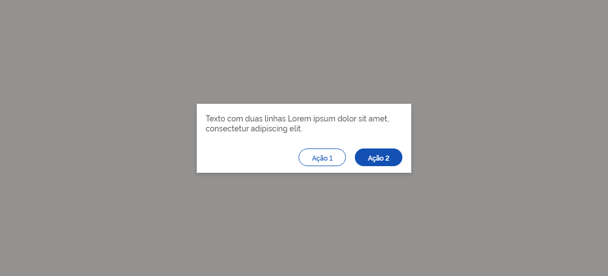

Sempre que existir uma escolha envolvendo exclusão for realizada pelo usuário (como "Descartar" ou "Excluir"), é necessário que haja a confirmação de sua escolha por uma "ação de confirmação".

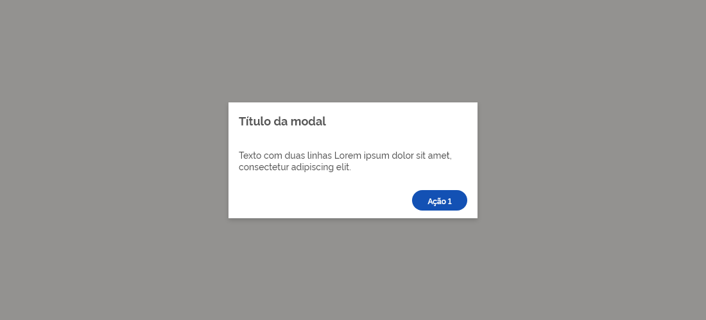

### Tom de voz

Não se deve utilizar rótulos de ação que não indique claramente a ação realizada. "Cancelar" e "Excluir" indicam melhor a ação do que o "Não" e "Sim" respectivamente.

---

## Modal de Opção

Oferece opções de escolha para o usuário, podendo ser apresentado por uma **lista** ou por algum **componente de seleção** (dependendo da finalidade da tarefa).

O uso de Título é altamente recomendável.

### Por Lista

Exibem uma lista de itens que entram em vigor imediatamente quando selecionados.

Pela característica do modal, esta opção deve ser utilizada com moderação. É preferível o uso de [dropdown](#) como uma opção menos disruptiva.

#### Comportamento:

- Ao escolher uma ação, fecha a modal;
- Ao clicar fora do modal (scrim), cancela a modal;
- Não possui botões.

### Por Seleção

Exige que o usuário confirme uma opção antes que ela seja submetida, permitindo uma chance de alterar sua escolha caso necessário. Uma vez confirmada, a ação será executada.

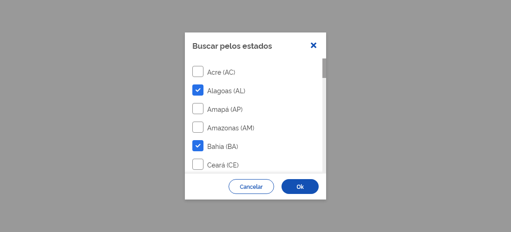

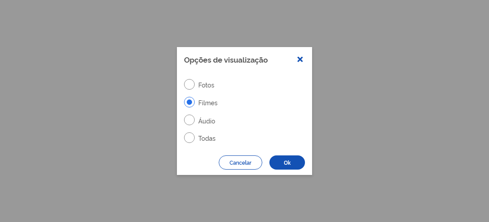

#### Comportamentos:

- Para confirmar uma escolha, o usuário deve escolher uma ação de confirmação;
- Para descartar ou cancelar uma escolha o usuário escolhe uma ação de negação;
- Clicar fora do modal (scrim) cancela a modal;
- As ações de confirmação e negação são obrigatórios.

---

## Modal de Entrada

Contém ações que requerem uma série de tarefas para serem concluídas tais como campos de entrada, de escolha e outros componentes ligados a formulário. Em resumo, esse tipo de modal pode ser utilizado para tarefas que atendam a qualquer um destes critérios:

- Incluem componentes que requerem entrada de teclado, como campos de formulário;
- Quando as alterações não são salvas instantaneamente;
- Quando uma modal abre modais adicionais de alerta ou de opção.

No smartphone, esse modal deve ser apresentada em tela cheia (fullscreen).

### Comportamento:

- Para salvar as entradas de dados o usuário deve escolher a opção "Salvar".
- Para descartar as aterações e sair, o usuário deve escolher a ação de negação, como "Voltar" ou pelo ícone de cancelar.
- A ação para confirmação deves ser desativada até que todos os campos obrigatórios sejam preenchidos.
- Clicar fora do modal (scrim) cancela a modal;

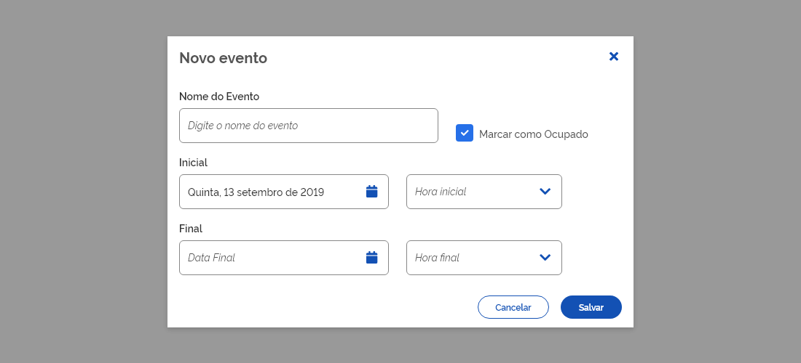

### Tom de Voz

Use verbos no indicativo, de forma descritiva como: "_Salvar_", "_Enviar_", "_Compartilhar_", "_Atualizar_" ou "_Criar_".

Evite termos vagos como "Concluídos", "_Ok_" ou "_Fechar_".

---

## Comportamento

### Interrupção

Os modais normalmente utilizam o scrim, criando uma área não interativa e exigindo que os usuários interrompam sua tarefa atual. Utilize o modal com moderação, pois nem todas as opções ou cenários justificam essa interrupção.

### Temporizador

Comportamento que pode ser aplicado em uma modal, geralmente o de Alerta, fazendo com que o fechamento seja feito de forma automatizada (após alguns segundos por exemplo), sem a necessidade de interação do usuário

Esse tipo de modal só pode ser utilizado em situações onde o conteúdo não faz mais sentido após um determinado período, tal como um [loading](#).

O usuário deve ser capaz de cancelar modal a qualquer momento, por isso o botão de ação de negação é obrigatório.

Utilize esta opção com moderação. Prefira o uso de [toast](#) como uma opção menos disruptiva.

### Posição

O modal deve manter o foco total do usuário até que uma ação seja tomada. Não deve ser ocultada por outros elementos. Alguns componentes de importância maior, como um [tooltip](#), podem ocultar uma parte do modal termporariamente. Componentes encontrados no modal de entrada podem ocultar parcialmente o modal, como caso de um [datapicker](#).

Deve ser centralizado na tela do dispositivo ou pode ser exibido próximo ao elemento que "solicitou/disparou" o modal.

### Rolagem

Evite barra de rolagem no modal. Quando necessária, o título deverá ser fixado na parte superior e os botões na parte inferior. Isso garante que o conteúdo selecionado permaneça sempre visível com o título e os botões, mesmo na rolagem.

Necessária a utilização do efeito de sombra na divisão entre o título e os botões sempre que existir conteúdo oculto.

Ações de Conhecimento ou de Confirmação podem estar desativadas até que o usuário consiga rolar até o final da rolagem.

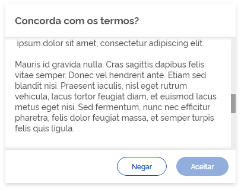
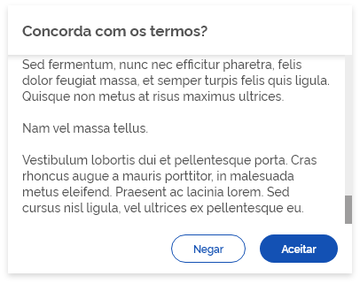

### Cancelar

Cancelar é a ação de ignorar a modal sem que uma ação de Conhecimento ou de Confirmação seja selecionada.

O modal pode ser cancelada:

- Clicando no [Scrim](#), porém, em alguns casos, a opção pode não existir;
- Interagindo com o botão "Cancelar";
- Interagindo com o ícone de fechar na parte superior a direita;
- Modal de Alerta nunca deve ser cancelada (via scrim ou ícone de cancelar) mas pode ser fechada por uma ação.

---

## Especificação

### Modal de Alerta

### Modal de Opção

### Modal de Entrada

### Tamanho máximo e mínimo

De acordo com a grid do ds.gov, o [card](#) do modal pode ocupar uma largura de até **8 colunas** ou **640px**. O tamanho mínimo é de **3 colunas** ou **220px**;

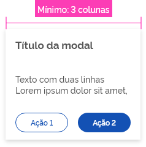
