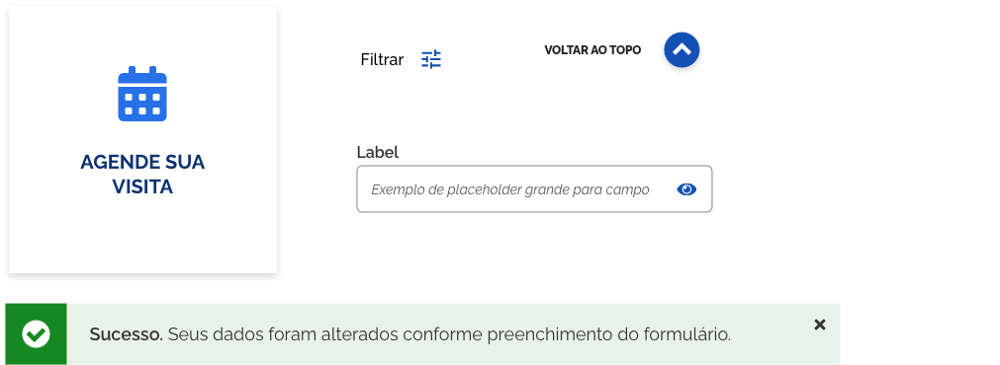
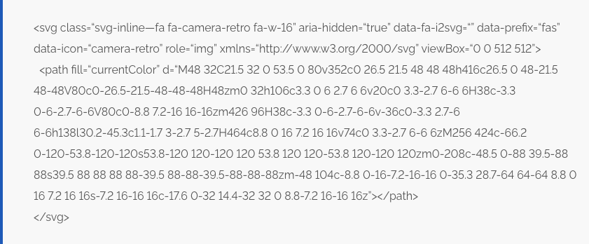
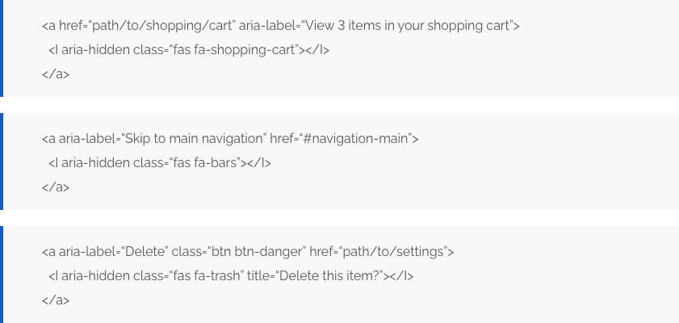

Os ícones são representações gráficas que podem simbolizar uma ação ou comunicar ao usuário possibilidades de mudanças de estados entre os elementos de uma interface. No caso do Design System, foi escolhida a coleção de ícones **"font awesome"** em sua versão 5.10.2 Solid (versão 5.10.2) por possuírem uma boa variedade de ícones com um layout simples, sintético e amigável.

---

## Font Awesome 5.10.2

Font Awesome é um conjunto de ferramentas de fontes e ícones com base em CSS e LESS. Foi feito por Dave Gandy para uso com o Twitter Bootstrap e mais tarde foi incorporado no BootstrapCDN.

A versão 5.10.2 possui uma grande quantidade de ícones. Foram expostos aqui, apenas alguns, para que se tenha ideia da variedade. Caso haja alguma funcionalidade, que não seja facilmente representada pelos aqui expostos, deve-se primeiro procurar uma opção dentro dos demais disponíveis na família de ícones e caso não haja, pode ser desenhado um novo, desde que siga o mesmo padrão visual e passe pela validação da equipe de Design.
No final desse documento foi incluído as orientações de uso de alguns dos ícones e deve ser seguido para que haja consistência entre os sistemas do governo.

### Exemplos de ícones aplicados aos componentes do Design System

## Ícones Criados

No Design System, foram criados dois ícones para representar certificado digital e NeoID pois não havia na família do fontawesoome algum que representasse bem esses dois conceitos.

## Princípios

### Experiência Única

Além da diversidade foi considerado que a Font Awesome traria uma padronização no visual dos ícones bastante importante no processo de reconhecimento e memorização dos usuários. Optou-se pelo uso da versão solid, então as características gráficas, como preenchimento, peso visual devem ser preservadas no momento de construção de novos ícones. Espera-se por tanto, que o padrão gráfico dos ícones por ser utilizado em vários sistemas do governo federal, passe a exercer um papel importante no reconhecimento dos usuários, no que diz respeito a interfaces governamentais. Sendo assim, é imprescindível que o designer e o desenvolvedor priorizem a utilização dos ícones, como demonstrado na tabela de orientações de uso. É fundamental atribuir os significados recomendados na tabela, evitando duplo sentido e facilitando o reconhecimento e memorização do usuário.

### Eficiência e Clareza

Os ícones da Font Awesome possuem um desenho sintético, porém de fácil compreensão, e devem exercer o papel de auxiliar ao usuário na execução de uma ação ou na representação de um serviço. É fundamental que a escolha do ícone para representar uma ideia, ação, ou serviço leve em consideração a experiência do usuário esteja sempre alinhada ao contexto cultural do Brasil, e que seja de fácil reconhecimento público. Para uma melhor legbilidade é recomendado que quando possível um label ou hint apareça ao lado do ícone reforçando a ideia a que foi atribuído.

### Acessibilidade

Os ícones podem transmitir todos os tipos de informações significativas, por isso é importante que eles alcancem a maior quantidade possível de pessoas. Para que isso aconteça, a Font Awesome categoriza seus ícones em dois tipos: decorativos e semânticos.

A acessibilidade para webfonts exige um pouco mais de trabalho, pois o método Webfont com CSS não pode adicionar atributos ou elementos ao seu HTML.

Ao usar ícones em sua interface do usuário, existem técnicas manuais e formas de ajudar a tecnologia assistencial a ignorar ou entender melhor o Font Awesome.

#### 1 | Ícones Decorativos

São usados apenas para reforço visual ou de branding. Se forem removidos da página, os usuários ainda entenderiam e poderiam utilizar a página. Se os ícones são puramente decorativos é necessário adicionar manualmente um atributo aria-hidden a cada um deles para que sejam acessíveis.

##### SVG com JavaScript

A acessibilidade do Font Awesome adiciona automaticamente aria-hidden=true e role=“img” aos seus atributos SVG in-line, para que seus ícones estejam adequadamente acessíveis.

#### 2 | Ícones Semânticos

São aqueles usados para transmitir um significado, ao invés de apenas decoração. Isso inclui ícones sem texto ao lado deles usando como controle interativo (botões, elementos de formulário, toggles…) Se os ícones tiverem significado semântico, é preciso adicionar manualmente algumas coisas para que ele seja acessado apropriadamente:

- Atributo aria-hidden
- Forneça uma alternativa de texto dentro de um elemento (ou similar). Inclua também o CSS apropriado
  para ocultar visualmente o elemento, mantendo- o acessível a tecnologias assistivas.
- Atributo title no ícone para fornecer uma dica de ferramenta para usuários com visão e que utilizam o mouse.

##### SVG com JavaScript

Obter a acessibilidade correta pode ser difícil. Por isso, Font Awesome simplifica o processo com o recurso de acessibilidade automática. Usando um pouco de JS, adicionando elementos e atributos no HTML de suporte para que os ícones fiquem acessíveis ao público mais amplo possível.

Se o ícone tiver significado semântico, coloque um atributo title=“meaning”. A acessibilidade automática cuida do resto, adicionando o seguinte:

• Função ARIA adequada ( role=“img”)
• Tag titlecom um atributo id adequado
• Atributo aria-labelledby e conecte-o à uma tag title

### Reutilização e Colaboração

Interfaces digitais do governo devem ser reutilizáveis pelos diversidade serviços disponíveis, sendo assim o uso da Font Awesome facilita esse reuso, por ser mais fácil de implementar. Caso haja necessidade podem ser incluídos novos ícones, porém é necessário consultar a tabela de orientações de uso, para verificar se já a funcionalidade já foi atribuída a algum ícone e também se há algum dentro do . É interessante que haja um trabalho em conjunto de criação e validação entre a equipe que vai propor novos ícones e a equipe de design para que sejam preservadas as características do padrão gráfico do Design System.

---

## Anatomia e Comportamento

### Grid do Fontawesome

Os ícones da Fontawesome foram determinados dentro de uma grid de 20 x 16px. Então, caso haja necessidade de criar novos ícones deve-se seguir essa mesma grid para que sejam conservadas as proporções e características estéticas dos mesmos.

### Tamanho Padrão no Design System

Os ícones clicáveis do sistema deverão, em sua maioria, ter corpo 16px.

#### 1| Área de Clique (Desktop)

A área de clique é a área total delimitada (área preenchida pelo ícone + área de margem do ícone) para que seja possível o clique através do mouse. Essa área no Design System deve ser de 24x24px,

#### 2 | Área de Toque

A área de toque dos ícones determina que além da área ocupada pelo ícone há um espaço invisível, que pode ser facilmente acessado pelo usuário, através do toque na tela ou do uso do mouse. Para garantir uma boa usabilidade, é importante que sejam preservadas as dimensões de 24px, indicadas abaixo, quando os ícones aparecem dispostos lado a lado.

A área de toque deve ser de 48 x 48px, garantindo que a experiência do usuário seja satisfatória no momento de acessar as funcionalidades através dos ícones, em dispositivos móveis ou artefatos digitais.

---

## Orientação de Uso

As principais funcionalidades dos sistemas do governo foram mapeadas e foram atribuídas a cada uma delas um símbolo representativo - os ícones da versão sólida da FontAwesome. É fundamental que os desenvolvedores e designers utilizem os ícones abaixo com mesma ação que lhe foi atribuída, Isso garante que cada sistema acessado pelo cidadão utilize o mesma linguagem e significado, tornando mais rápida a experiência e o reconhecimento
do público ao acessar as funcionalidades dos diversos sistemas do governo federal.

