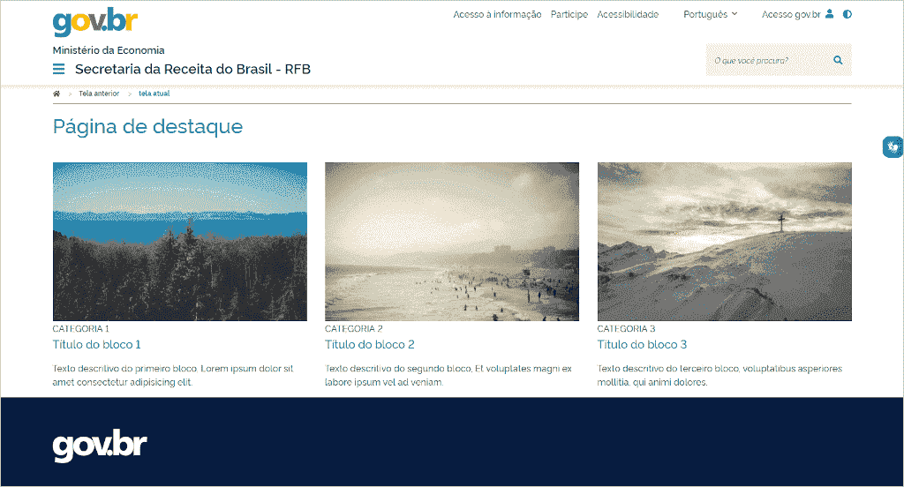
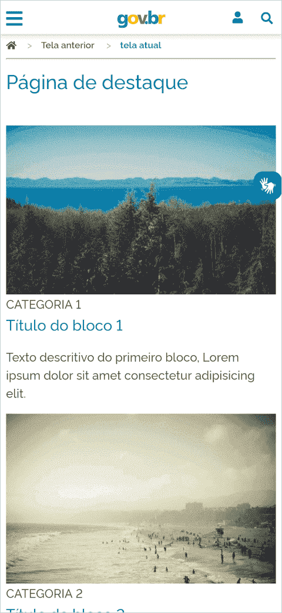

Os templates foram criados para facilitar o uso dos componentes. Dê uma olhada na lista de templates para ver se já existe algum que atenda a sua necessidade.

Caso nenhum deles atenda, você poderá uma criar o seu próprio baseado em algum deles.

## Criando uma tela de conteúdo simples

No exemplo a seguir usaremos o template padrão de sites, mas também serve para sistemas.

> Recomendamos o uso do editor de texto **Visual Studio Code** - <https://code.visualstudio.com> mas você poderá usar qualquer outro de sua preferência.
>
> A Grid e alguns utilitários do **Bootstrap** - <https://getbootstrap.com> são compatíveis com o Design System.

1. Acesse o template padrão de sites no menu principal: **templates -> Sites e portais -> Template padrão**
1. Copie o código do template no editor de texto
1. Devido o longo conteúdo do template, faça uma busca pelo texto `<h1 class="main-title">Título da página</h1>`

Repare que este elemento é filho do elemento `<div class="container">` esta classe é reponsável por manter a grid de responsividade da tela, portanto não remova ela. O conteúdo de dentro dela pode ser modificado de acordo com a sua necessidade.

Vamos modificar o título da página e inserir textos e imagens para criar uma tela simples. Usaremos a Grid para organizar o conteúdo ficar adaptável em dispositivos móveis. Veja mais informações sobre a Grid em **Fundamentos Visuais -> Sistema de Grid**.

```html
...
<!-- Conteúdo principal -->
<main id="content" class="page-content">
  <div class="container">
    <h1 class="main-title">Página de destaque</h1>
    <div class="row">
      <div class="col">
        
        <span>Técnologia</span>
        <h2>Título do bloco 1</h2>
        <p>
          Texto descritivo do primeiro bloco, Lorem ipsum dolor sit amet
          consectetur adipisicing elit.
        </p>
      </div>
      <div class="col">
        
        <span>Técnologia</span>
        <h2>Título do bloco 2</h2>
        <p>
          Texto descritivo do segundo bloco, Et voluptates magni ex labore ipsum
          vel ad veniam.
        </p>
      </div>
      <div class="col">
        
        <span>Técnologia</span>
        <h2>Título do bloco 3</h2>
        <p>
          Texto descritivo do terceiro bloco, voluptatibus asperiores mollitia,
          qui animi dolores.
        </p>
      </div>
    </div>
  </div>
</main>
...
```

A imagem a seguir ilustra o conteúdo criado em desktop.



Agora veja como ficou para celulares:


